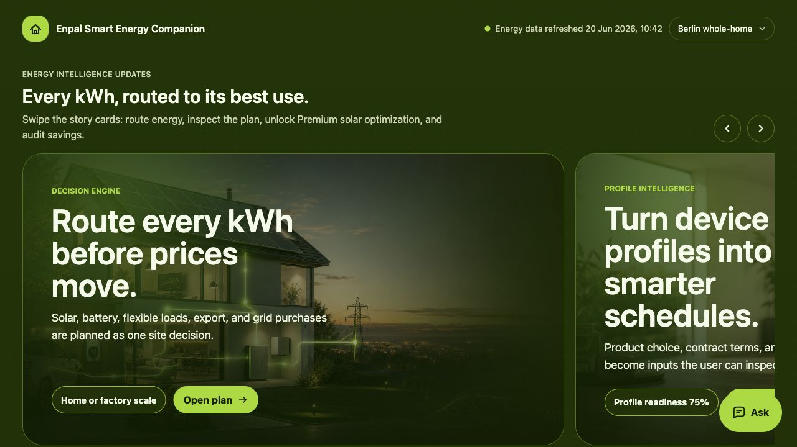

# Enpal Smart Energy Companion

**Every kWh, routed to its best use.**

Enpal Smart Energy Companion is a household and light-industrial energy planning demo that turns dynamic tariffs, solar production, batteries, EV charging, device profiles, and export value into one clear daily action plan.

It is designed for a hackathon setting where the product needs to be understandable in seconds: what to do now, how much it saves, and why the recommendation is trustworthy.



## Product Idea

Most energy dashboards show numbers. This project tries to make a decision.

The companion answers one practical question:

> Where should each kWh go next: home load, EV charging, battery storage, grid export, or delayed low-price grid use?

The demo combines three layers:

- **Decision layer**: a simple next-best-action recommendation for the user.
- **Optimization layer**: scheduling and routing logic for flexible loads, solar, battery, import, and export.
- **Trust layer**: clear source labels, formula versions, constraints, and counterfactual savings.

The user should not need to understand market mechanics, SOC math, feed-in opportunity cost, or tariff windows before making a safe decision.

## Core Use Cases

### Basic: EV Smart Charging

For everyday households, the Basic plan focuses on one high-value behavior: charge the EV before departure during the cheapest safe windows.

The scheduler considers:

- EV energy needed
- Departure deadline
- Wallbox power limits
- User comfort buffer
- Contract tariff and dynamic price windows
- Normal habit cost vs optimized cost

The demo keeps a canonical example:

- **24 kWh** needed
- **EUR 8.40** normal charging cost
- **EUR 3.24** optimized charging cost
- **EUR 5.16** expected saving

### Premium: Solar Use, Store, Sell, Buy

Premium expands the problem from "when should I charge?" to "how should the whole site route energy?"

It plans:

- Use rooftop solar for current load when self-use beats export value
- Store surplus solar when evening demand or peak prices make it valuable
- Sell energy when feed-in value beats future self-use value
- Buy low-price grid power later when it is cheaper than using scarce stored energy

The demo includes both:

- **Berlin whole-home profile** for residential EV, home load, solar, and battery decisions
- **Munich factory profile** for larger industrial flexible loads, battery arbitrage, process demand, and higher Premium value

## How It Works

The project uses a release-friendly structure:

```text
apps/
  companion-web/
    public/       Static product demo
    server/       Local API and static file server

packages/
  energy-engine/  Calculation, routing, profile, fixture, and API logic

fixtures/
  companion-demo/ Demo household, factory, tariff, forecast, and routing data

docs/
  research/       Evidence notes and claim ledger
  pitch/          Hackathon pitch materials
  assets/         README and documentation visuals

deliverables/
  decks/          PowerPoint deliverables
  visual-assets/  Generated product and energy visuals

tests/            Node-based engine and API tests
```

## Optimization Model

The Basic EV scheduler minimizes charging cost while respecting user constraints:

```text
min sum(charge_kwh[t] * final_import_price[t])
  + missed_deadline_penalty
  + user_inconvenience_penalty
```

The Premium optimizer models whole-site routing:

```text
solar_to_home[t]
solar_to_ev[t]
solar_to_battery[t]
solar_to_export[t]
grid_to_home[t]
grid_to_ev[t]
grid_to_battery[t]
battery_to_home[t]
battery_to_ev[t]
battery_soc[t]
```

Its objective is not just "use solar first." Solar has a cash cost of zero, but it still has an economic cost: the feed-in credit that could have been earned by selling it.

```text
min cash_import_cost
  - export_credit
  + solar_opportunity_cost
  + battery_degradation_cost
  + comfort_penalty
  + risk_penalty
```

This is why the UI avoids saying "solar is free." The product compares the marginal value of using, storing, selling, or buying energy in each time window.

## Trust and Data Design

The companion separates source quality from product claims.

Preferred data sources:

1. User-confirmed contract terms, smart meter readings, wallbox data, inverter data, and device telemetry.
2. Public energy and weather sources such as market prices, solar forecasts, and weather data.
3. Commercial connectors such as home energy APIs, inverter clouds, OCPP, or Home Assistant.
4. Estimates, always labelled as estimates and kept out of high-confidence savings claims.

Each optimization result can carry:

- Input snapshot
- Formula version
- Forecast vs actual labels
- Constraint list
- Counterfactual baseline
- Audit steps
- Limitations

## API Surface

Main endpoint:

```http
POST /api/plans/optimize
```

The endpoint accepts a planning tier and profile context, then returns a unified optimization result for either Basic EV scheduling or Premium whole-site routing.

Useful local routes:

- `/` - product demo
- `/prototype.html` - compatibility route for the previous demo URL
- `/enpal-smart-energy-companion-design-en.html` - design document
- `/api/health` - health check
- `/api/plans/optimize` - optimization API

## Quick Start

```bash
npm start
```

Then open:

```text
http://127.0.0.1:4173/
```

Run tests:

```bash
npm test
```

## Pitch Project

The richer presentation project lives here:

```text
energy-profit-planner-pitch/
```

Its presentation app is in:

```bash
cd energy-profit-planner-pitch/presentation
npm run build
npm run lint
```

## Hackathon Positioning

The advantage is not another price calculator. The advantage is a decision product:

- It explains energy routing in user language.
- It makes Basic useful immediately for EV charging.
- It makes Premium visibly more valuable for solar, battery, export, and factory-scale flexibility.
- It keeps every savings claim tied to a visible trust receipt.

The intended 30-second user takeaway:

1. What should I do now?
2. How much can I save?
3. Why should I trust the number?

## Project Status

This repository is a demo and pitch-ready release structure. Real-world deployment would require production connectors, user consent flows, verified billing contracts, device control safeguards, and live market/weather data pipelines.
